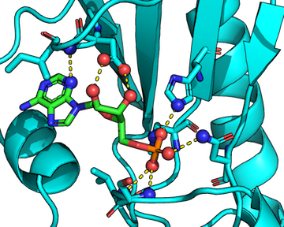

Software to rigorously define intermolecular H-bonds by donor/acceptor chemistry and geometric constraints, which was developed, used, and described in detail in 

- Raschka, Sebastian, Alex Wolf, Joseph Bemister‐Buffington, and Leslie A. Kuhn (2018) “Protein-ligand interfaces are polarized: discovery of a strong trend for intermolecular hydrogen bonds to favor donors on the protein side with implications for predicting and designing ligand complexes” Journal of Computer-Aided Molecular Design. *Journal of Computer-Aided Molecular Design* (accepted manuscript) [[biorxiv preprint](https://www.biorxiv.org/content/early/2018/02/05/260612)]

 

### Links

- Journal paper: [https://www.biorxiv.org/content/early/2018/02/05/260612](https://www.biorxiv.org/content/early/2018/02/05/260612)
- Code repository: [https://github.com/psa-lab/Hbind](https://github.com/psa-lab/Hbind)
- Documentation: [https://psa-lab.github.io/Hbind](https://github.com/psa-lab/Hbind)

 
 
 

---

[Interactions between an PKCI-substrate analog ([1KPF](https://www.rcsb.org/pdb/explore.do?structureId=1kpf))  with its ligand (adenosine monophsophate) via [HbindViz](https://github.com/rasbt/HbindViz) and [PyMOL](https://pymol.org); hydrogen atoms not shown]